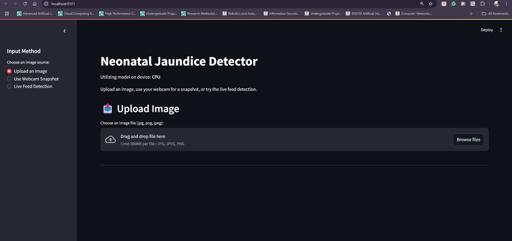
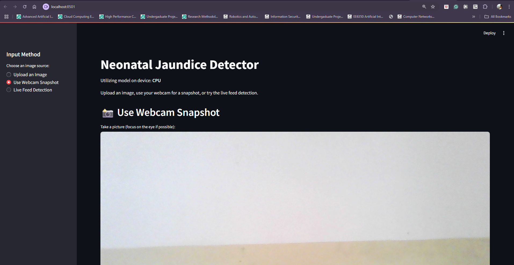
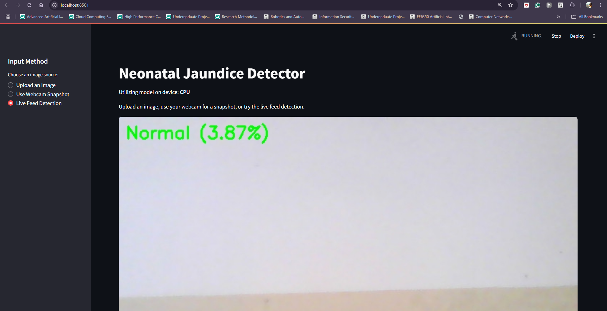

# Neonatal Jaundice Detection via CNN + MobileNetV3-Small + Streamlit

This project implements a machine learning model to detect potential signs of neonatal jaundice from images of an infant's eyes or skin. It includes a Streamlit web application for easy interaction, allowing users to upload images, use a webcam for snapshots, or utilize a live camera feed for real-time (frame-by-frame) analysis.

## Model Details

*   **Architecture:** MobileNetV3-Small (fine-tuned)
*   **Framework:** PyTorch
*   **Training Data:** [Kaggle Jaundice Image Data](https://www.kaggle.com/datasets/aiolapo/jaundice-image-data)
    *   Approx. 200 Jaundiced images
    *   Approx. 560 Normal images
*   **Input Image Size:** 224x224 pixels (RGB)
*   **Output:** Binary classification (Normal / Jaundice) with a probability score.

### Training Process Overview 

The model was trained using a Jupyter Notebook `jaundice-detection.ipynb` . The key steps involved in the training pipeline were:

1.  **Environment Setup:** Installation of necessary libraries such as PyTorch, TorchVision, Albumentations, OpenCV, Scikit-learn, and Kaggle API for data download.
2.  **Data Acquisition & Preparation:**
    *   The "Jaundice Image Data" dataset was downloaded directly from Kaggle using its API.
    *   Images were organized into `Normal` and `Jaundice` class folders.
    *   A preliminary Exploratory Data Analysis (EDA) was performed to understand image counts, and view sample images.
3.  **Data Augmentation and Preprocessing:**
    *   **Albumentations** library was used for image transformations.
    *   **Training augmentations** included: `SmallestMaxSize`, `RandomCrop` (to 224x224), `Rotate`, `HorizontalFlip`, and `RandomBrightnessContrast`.
    *   **Validation augmentations** included: `SmallestMaxSize` and `CenterCrop` (to 224x224).
    *   All images were normalized using ImageNet's mean and standard deviation.
4.  **Dataset and DataLoader Creation:**
    *   A custom PyTorch `Dataset` class (`EyeJaundiceSet` or similar) was implemented to load images and apply transformations.
    *   The dataset was split into training and validation sets (e.g., 85% train, 15% validation).
    *   PyTorch `DataLoaders` were created to efficiently load data in batches for training and validation, handling shuffling for the training set.
5.  **Model Definition (Transfer Learning):**
    *   A pre-trained MobileNetV3-Small model (weights from ImageNet) was loaded using `torchvision.models`.
    *   The final classifier layer of MobileNetV3-Small was replaced with a new `nn.Linear` layer suited for binary classification (outputting 1 logit).
6.  **Training Configuration:**
    *   **Loss Function:** `nn.BCEWithLogitsLoss` (Binary Cross-Entropy with Logits) was used, suitable for binary classification with a sigmoid applied implicitly.
    *   **Optimizer:** `AdamW` optimizer was chosen.
    *   **Learning Rate Scheduler:** `ReduceLROnPlateau` was implemented to reduce the learning rate if validation loss stagnated.
7.  **Training Loop:**
    *   The model was trained for a set number of epochs (e.g., 10-15 epochs).
    *   In each epoch:
        *   The model was set to `train()` mode, gradients were calculated, and weights were updated using backpropagation.
        *   The model was then set to `eval()` mode for validation on the unseen validation set.
        *   Metrics such as training/validation loss, accuracy, sensitivity (recall for Jaundice), and specificity were calculated and printed.
8.  **Model Evaluation (Post-Training):**
    *   Grad-CAM was used to visualize which parts of the image the model focused on for its predictions, ensuring it learned relevant features (e.g., the eye region).
9.  **Model Saving:**
    *   The state dictionary of the best performing (or final epoch) model was saved to a `.pt` file (e.g., `jaundice_mobilenetv3.pt`) for later use in inference and the Streamlit application.
    *   The model was also exported to ONNX format for potential cross-platform deployment.


## Features

*   **Jaundice Detection Model:** Utilizes a Convolutional Neural Network (CNN), specifically MobileNetV3-Small, trained on a dataset of infant images.
*   **Streamlit Web Interface:** Provides an easy-to-use UI with multiple input methods:
    *   Image Upload
    *   Webcam Snapshot
    *   Live Camera Feed Detection
*   **Real-time Feedback:** Displays the predicted class (Normal/Jaundice) and an estimated confidence score.

## Screenshots

# Upload an Image

# Webcam Snapshot

# Live Feed Detection



## Project Structure

```
.
├── jaundice_env/           # Python virtual environment (excluded by .gitignore)
├── data/                   # (Optional) Dataset images (likely excluded by .gitignore)
├── app.py                  # Main Streamlit application script
├── jaundice_mobilenetv3.pt # Trained PyTorch model file (or similar name)
├── requirements.txt        # Python package dependencies
├── .gitignore              # Specifies intentionally untracked files
└── README.md               # This file
```

## Setup and Installation

Follow these steps to set up the project environment and run the application locally.

### Prerequisites

*   Python 3.8+
*   Git
*   Access to a webcam (for webcam and live feed features)

### 1. Clone the Repository

```bash
git clone https://github.com/sahanrashmikaslk/Neonatal_jaundice_detection.git
cd Neonatal_jaundice_detection
```


### 2. Create and Activate a Virtual Environment

It's highly recommended to use a virtual environment to manage project dependencies.

**Linux/macOS:**
```bash
python3 -m venv jaundice_env
source jaundice_env/bin/activate
```

**Windows (Git Bash or PowerShell):**
```bash
python -m venv jaundice_env
.\jaundice_env\Scripts\activate
```

### 3. Install Dependencies

Install the required Python packages using the `requirements.txt` file:
```bash
pip install -r requirements.txt
```

### 4. Obtain the Dataset (If not included)


The model was trained on the [Kaggle Jaundice Image Data](https://www.kaggle.com/datasets/aiolapo/jaundice-image-data).
1.  Download the dataset from Kaggle.
2.  Ensure you have the Kaggle API token set up (`~/.kaggle/kaggle.json` or `C:\Users\<YourUser>\.kaggle\kaggle.json`).
3.  Download and extract the data into a `data/` directory in the project root:
    ```bash
    # Make sure your Kaggle API token is configured
    mkdir data
    kaggle datasets download -d aiolapo/jaundice-image-data -p ./data --unzip
    ```
    The expected structure within `data/` is:
    ```
    data/
    ├── Jaundice/
    └── Normal/
    ```


## Running the Application

Once the setup is complete, you can run the Streamlit web application:

```bash
streamlit run app.py
```

This will typically open the application in your default web browser at `http://localhost:8501`.

## How to Use

1.  Launch the application using the command above.
2.  Select an input method from the sidebar:
    *   **Upload an Image:** Browse and select an image file (jpg, png, jpeg).
    *   **Use Webcam Snapshot:** Allow webcam access, position the subject, and click "Take a picture".
    *   **Live Feed Detection:** Allow webcam access, click "Start Live Detection". The app will continuously analyze frames. Click "Stop Live Detection" to end.
3.  Click the "Analyze" button (for uploads/snapshots) or observe the live feed.
4.  The prediction ("Normal" or "Jaundice") along with a confidence score will be displayed.

**Tips for Best Results (especially for webcam/live feed):**
*   Ensure good, consistent lighting on the subject's eye or skin.
*   Try to get a clear, focused image/video of the sclera (white part of the eye) if possible.
*   Minimize movement during live detection.


